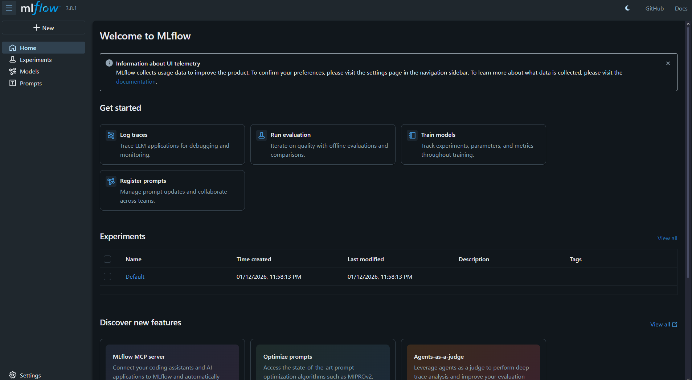
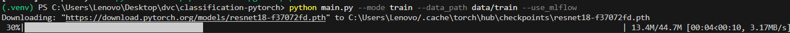
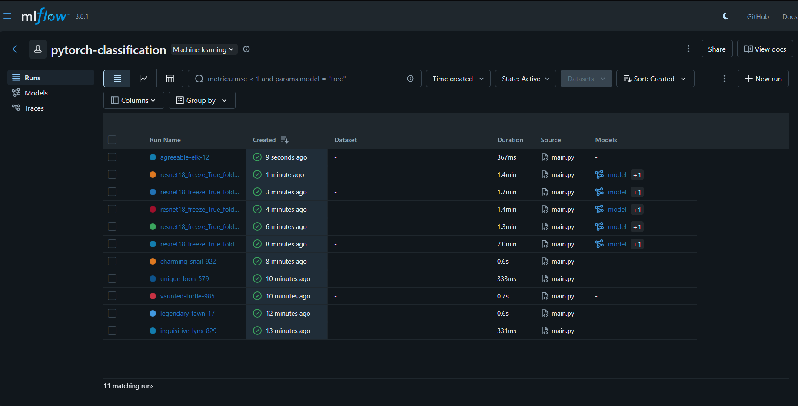
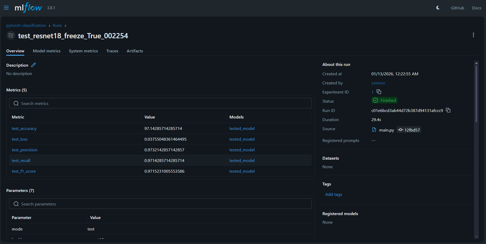

# PyTorch Classification with DVC & MLflow - Homework Report

## Student Progress Summary

This report documents the steps taken to complete the PyTorch classification homework assignment and the roadblock encountered.

## Steps Completed Successfully

### 1. Repository Setup

- Forked the original repository: `https://github.com/besmaguesmi/classification-pytorch`


- Cloned the forked repository to local machine
- Set up Python virtual environment (`.venv`)

### 2. Dependencies Installation

- Installed required packages:
  ```bash
  pip install dvc dvc-gdrive
  pip install torch torchvision scikit-learn mlflow pillow numpy matplotlib seaborn pandas
  ```

#### 2.1 Setup up Google Service

Succeffully setup the google service account and the shared drive


### 3. DVC Configuration Attempts

- Successfully configured DVC remotes:
  - Found existing Google Drive remote: `gdrive://0AOwhfnYtOjdFUk9PVA`
- Attempted data pull: `dvc pull` succefull


### 4. MLflow Setup

- Installed MLflow
- Successfully started MLflow UI

  

  4.1 MLflow runs: training the models was successfuk through mlflow as shows in this attachment:
  
  
  also testing the runs was also successful:
  

### 5. Code Analysis

- Examined project structure and dependencies
- Understood expected data structure:
  ```
  data/
  ├── train/
  │   ├── sea/     (image files)
  │   └── forest/  (image files)
  └── test/
      ├── sea/
      └── forest/
  ```
